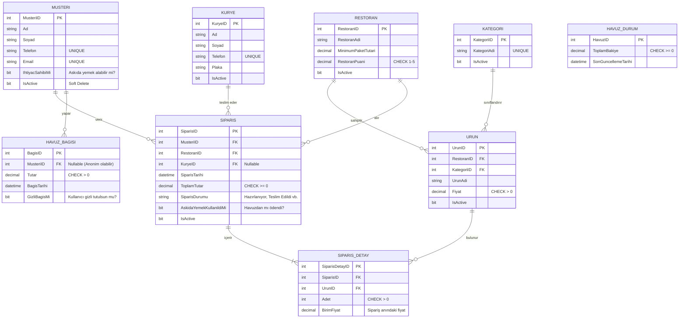

# 01: Varlık-İlişki (ER) Tasarımı ve İş Kuralları

Bu doküman, Çevrimiçi Yemek Sipariş Platformu veritabanının tasarımını, tablolar arası ilişkileri ve projedeki "Askıda Yemek" modülünün iş kurallarını tanımlar. Proje hocanıza sunacağınız veya GitHub'a yükleyeceğiniz **ilk dokümandır**.

## 1. Veritabanı Varlık-İlişki (ER) Diyagramı

Sistemimiz 3. Normal Form'a (3NF) uygun olarak tasarlanmıştır. Veri tekrarları (redundancy) önlenmiş ve tüm ilişkiler doğru bir şekilde bağlanmıştır.

## 2. Tablo Açıklamaları ve 3. Normal Form (3NF) Uyumluluğu
Veritabanımız 3NF kurallarına uygundur. Hiçbir tabloda, o tablonun Primary Key'ine doğrudan bağlı olmayan bir özellik yoktur.
- `SiparisDetay` tablosunda `BirimFiyat` tutulması 3NF'yi bozmaz. Çünkü sipariş verildiği andaki fiyatın kaydedilmesi gerekir. Ürün fiyatı sonradan artarsa eski siparişlerin tutarı değişmemelidir. Bu standart bir e-ticaret kuralıdır.
- Silme işlemleri fiziksel olarak yapılmayacak, `IsActive` (0 veya 1) kolonu ile "Soft Delete" mantığında yürütülecektir.

## 3. "Askıda Yemek" Modülü İş Kuralları

Bu proje kapsamındaki en özel modül "Askıda Yemek" modülüdür. Mantığı şu şekilde kurgulanmıştır:

1. **Bağış Yapılması:**
   - Hayırsever bir müşteri, sisteme para bağışında bulunur. Bu işlem `HAVUZ_BAGISI` tablosuna kaydedilir.
   - Müşteri bağış yaparken `GizliBagisMi = 1` seçerse kimliği gizli tutulur.
   - Bir müşteri bağış yaptığında, yazacağımız bir `TRIGGER` otomatik olarak çalışır ve `HAVUZ_DURUM` tablosundaki `ToplamBakiye` miktarını bağışlanan tutar kadar artırır.

2. **Bağışın Kullanılması:**
   - Sistemi kullanan müşterilerden bazıları, yetkililerce onaylanmış "İhtiyaç Sahibi" (`IhtiyacSahibiMi = 1`) statüsündedir.
   - Bu müşteriler sipariş verirken sepet tutarı, havuzdaki toplam bakiyeden (`HAVUZ_DURUM.ToplamBakiye`) küçük veya eşitse, siparişi "Askıdan" ödeyebilirler.
   - Bu durumda `SIPARIS` tablosuna sipariş kaydedilir ve `AskidaYemekKullanildiMi = 1` olarak işaretlenir.
   - Sipariş onaylandığında başka bir `TRIGGER` devreye girerek, harcanan sipariş tutarını `HAVUZ_DURUM.ToplamBakiye`'den otomatik olarak düşer.

## 4. Kısıtlamalar (Constraints)
- **Primary Key (PK):** Her tablonun benzersiz bir kimliği vardır.
- **Foreign Key (FK):** Tablolar birbiriyle mantıklı referanslarla bağlıdır. Bir siparişte olmayan bir müşteri ID'si veya restoran ID'si girilemez (Referential Integrity).
- **CHECK:** Ürün fiyatları ve sipariş tutarları 0'dan büyük olmalıdır. Restoran puanı 1 ile 5 arasında olmalıdır. Havuz bakiyesi eksiye (0'ın altına) düşemez.
- **UNIQUE:** Müşteri telefon numaraları ve e-posta adresleri sistemde tekrar edemez.
